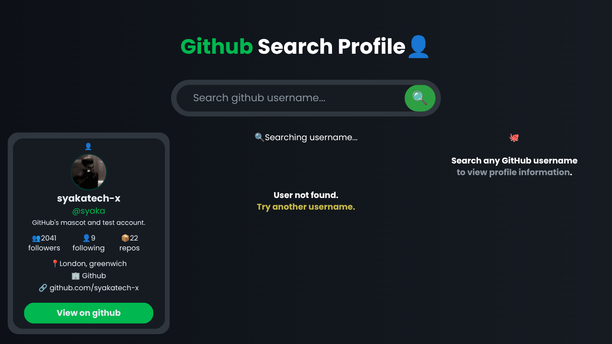

GitHub Search Profile

A simple React application that allows users to search for any GitHub profile using the GitHub REST API.

This project was built to practice React fundamentals, component architecture, asynchronous data fetching, and state management.

«Note: This project was developed entirely on an Android phone as part of my learning journey.»

---

Features

- Search any GitHub username
- Display profile information
- Loading state
- Error handling
- Empty state
- Responsive card layout
- Direct link to GitHub profile

---

Built With

- React
- JavaScript (ES6+)
- CSS3
- Fetch API
- GitHub REST API

---

Project Structure

Project Structure

- src/
  - Component/
    - Header
    - SearchBar
    - EmptyState
    - Loading
    - ErrorMessage
    - ProfileCard
  - Services/
    - githubApi.js
  - App.jsx
  - App.CSS3

---

What I Learned

Through this project I practiced:

- React Components
- Props
- useState
- Conditional Rendering
- Async / Await
- Fetch API
- Error Handling
- Loading State
- Component Separation
- Folder Structure
- Working with External APIs

---

API

This project uses the GitHub REST API.

https://api.github.com/users/{username}

Authentication is supported using a GitHub Personal Access Token to avoid API rate limits.

---

Future Improvements

- Search by pressing Enter
- Better responsive design
- Dark / Light theme
- Copy profile URL
- Recent search history

---

Screenshot

---

Author

Syaka

Aspiring Software Engineer from Indonesia.

Currently learning:

- React
- Next.js
- Node.js
- Express.js
- MongoDB

---

«Stay curious. Keep building.»
